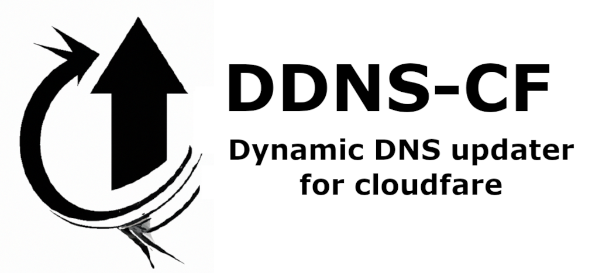

# DDNC-CF - DNS Dinamic updater for cloudfare

Python script for update a domain/subdomain IP on cloudfare DNS service

The project is in alpha version, but is operative. You can try it and contact me if you have any question or suggestion.

** Disclaimer **

This is my first GitHub project so I hope you forgive any errors I may have in the publication.
